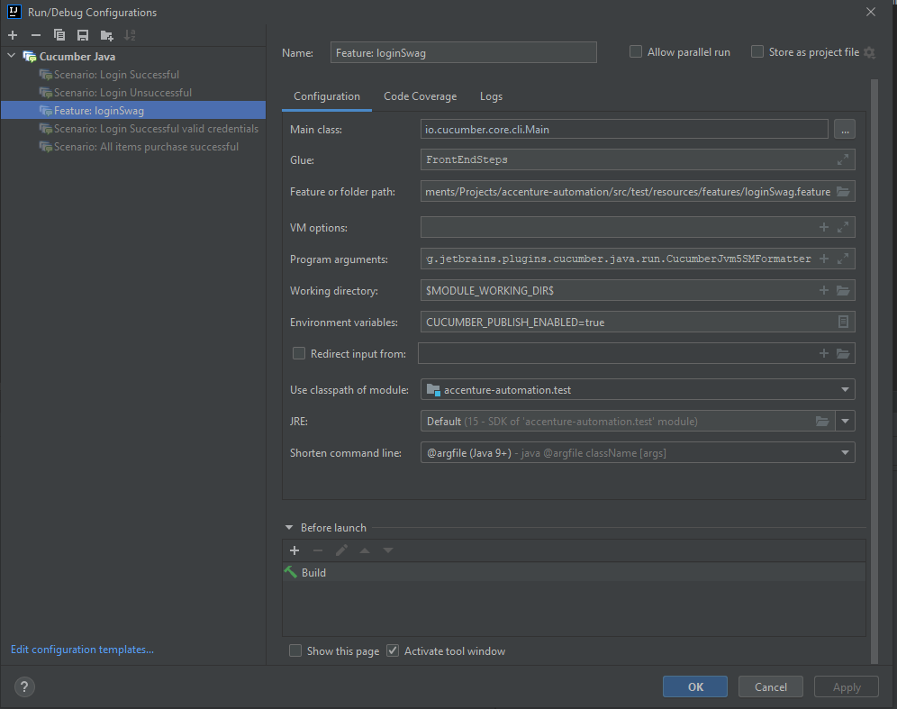
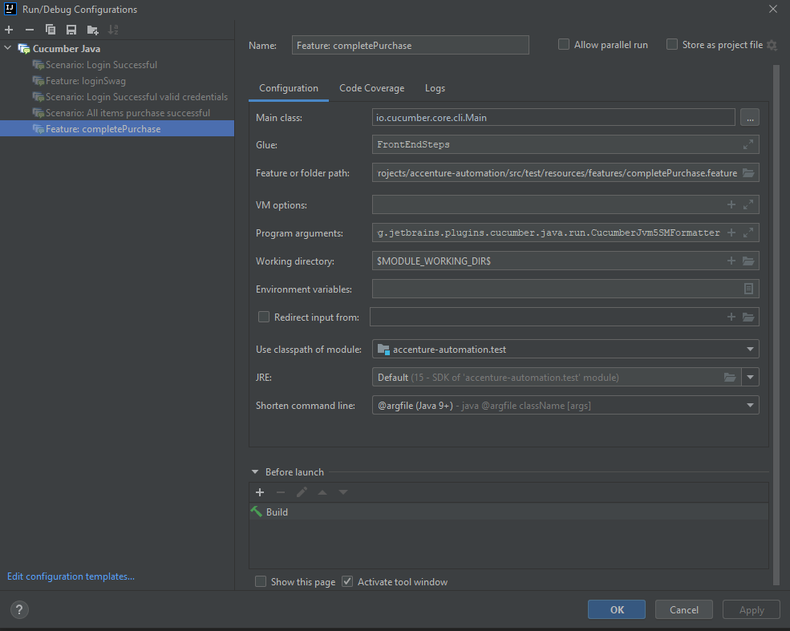
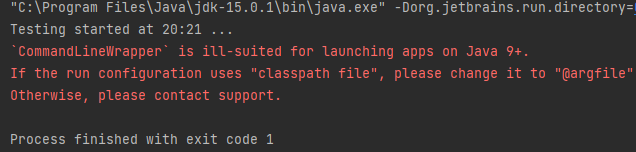
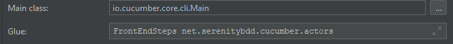
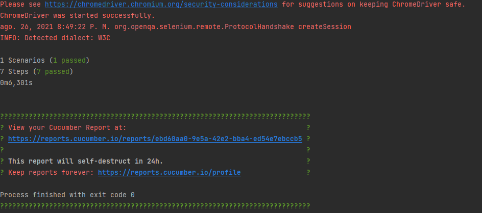

# **ACCENTURE SIMPLE BDD FRAMEWORK**

This framework has been created using IntelliJ as IDE, Gradle for dependencies management and following a page object model.
The tests are executed in Chrome. The driver is stored in the 'resources' folder.

It requires the creation of some Gradle tasks to execute the different tests 
included.

For Login feature:

And for E2E feature:

## **TROUBLESHOOTING**

Maybe you can face several issues when you try to create these Gradle tasks. The most common problems are the next:

Intellij requires that the command is shortened. To achieve that, you must include the parameter '@argfile (Java 9+)' in Shorten command line parameter:

Another issue is that by default, the IDE can include an unnecessary class to Glue parameter:

Please, just remove 'net.serenitybdd.cucumber.actors'.

## **REPORTER**

Regarding the reporter, I would like to clarify that I have decided to use online Cucumber reports generated every time tests are executed, and you can find the link on the terminal output.

*It is possible to create more positive and negative scenarios. I would like to give you some examples:

### Login:

-login successful using the other two available users

-login unsuccessful using an invalid username

-login unsuccessful using invalid input type data, i.e., special characters and emojis (In this case, the requirements are unknown).

### E2E:

-Assert successful flow in more steps than I did in the feature

-Check cancel buttons and flow work correctly.

-Buy one, several, all items.

-Buy one when another is cancelled.

Of course, do not hesitate to contact me if there is any question you have.

Juan José Vidal Hernández

mail: juanvidher@gmail.com

phone: +34675208743

